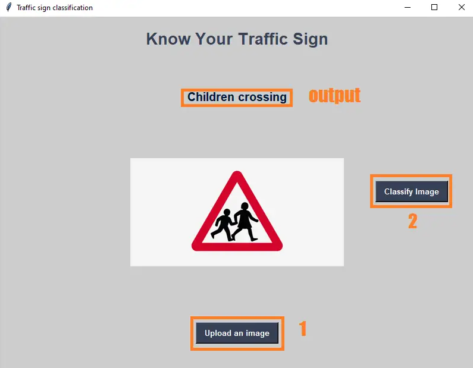

# TRAFFIC SIGNS RECOGNITION

Welcome to **Know Your Traffic Sign**, the ultimate traffic sign classification tool! 🚦

The Traffic Signs Recognition Using CNN & Keras In Python was developed using Python Programming with CNN and Keras.
There are several different types of traffic signs like speed limits, no entry, traffic signals, turn left or right, children crossing, no passing of heavy vehicles, etc.

Traffic sign classification is the process of identifying which class a traffic sign belongs to.


A Traffic Signs Recognition Python project example, we will build a deep neural network model that can classify traffic signs present in the image into different categories.
With this model, we are able to read and understand traffic signs which are a very important task for all autonomous vehicles.
This project leverages a pre-trained model to accurately classify various traffic signs using images. It's a fun and interactive way to test your knowledge about traffic signs or just to see some cool machine learning in action. Let's dive in! 🎉



## Features

- **User-Friendly Interface**: Upload an image of a traffic sign and get instant classification.
- **Comprehensive Classification**: Identifies and names 43 different types of traffic signs.
- **Interactive and Fun**: An intuitive GUI built with Tkinter makes it easy for anyone to use.

## Getting Started

### Prerequisites

Make sure you have the following installed:

- Python 3.9.13
- Tkinter
- Pillow
- NumPy
- TensorFlow 2.12
- Keras

### Installation

1. **Clone the repository**:
    ```bash
    git clone https://github.com/TeranGit/TrafficSignsRecognition.git
    ```

2. **Create and activate a virtual environment**:
    ```bash
    py -m venv venv
    source venv/bin/activate  # On Windows use `venv\Scripts\activate`
    ```

3. **Install the dependencies**:
    ```bash
    pip install -r requirements.txt
    ```

4. **Run the application**:
    ```bash
    python gui.py
    ```

## Usage

1. Launch the application by running `python gui.py`.
2. Click on "Upload an image" and select an image of a traffic sign.
3. Click "Classify Image" to see the classification result displayed on the GUI.

## Example Images

Included in this repository are some example images you can use to test the application:

- `sign1.jpg`
- `sign2.jpg`
- `stop.jpg`

## Contributing

Contributions are welcome! Please feel free to submit a Pull Request.

## License

This project is licensed under the GPL License. See the [LICENSE](LICENSE) file for details.

## Acknowledgements

- This project uses a pre-trained model for traffic sign classification.
- Thanks to the open-source community for providing such valuable tools and libraries.

Enjoy using **Know Your Traffic Sign** and happy coding! 🚀
